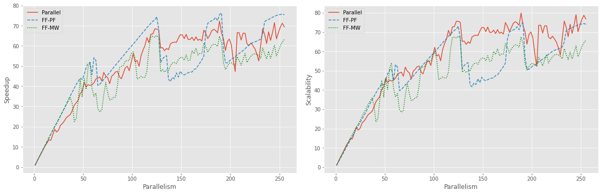

# KNN Parallel Implementation
This project consists in implementing the KNN algorithm taking advantage of a multicore architecture in C++. We evaluate and compare different models by analyzing the speedup/scalability/efficiency with respect to the increasing number of cores.

## Results
The following figure compares the results from three models implemented using:
- C++ STL pure implementation
- FastFlow ParallelFor implementation
- FastFlow custom Master-Worker implementation

The X axis represents the number of cores, and the Y axis represents the speedup/scalability metrics. We observe that after ~120 cores, the speedup will not increase anymore. This limitation is due to the increase of thread overhead operations with respect to the timpe spent in computing the actual data.